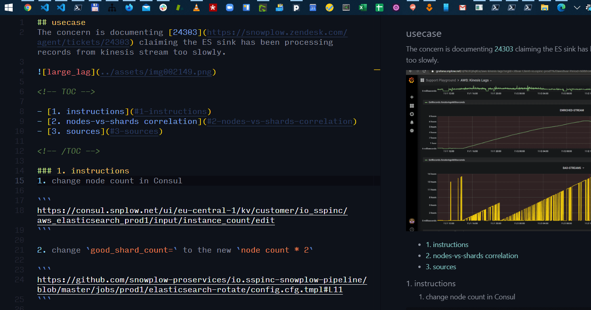

## Support Docs of Snowplow Analytics: A Place to Write 
> ...When we remove the pre (finding the pen, the paper, the notebook, the software) and the post (finding a way to publish it), it turns out that we write more often, and writing more often leads to writing better.

— From [A place to write — Seth's Blog](https://seths.blog/2020/12/a-place-to-write/)

The concern of this repository is the facilitation of writing process for tech support engineers of Snowplow Analytics. It is an unabashed fork of [JupiterOne docs](https://github.com/JupiterOne/docs) that I am grateful for opening the door between Github Markdown and Zendesk Helpcenter! 

The Repo consists of:
* Knowledge base created and utilized by support engineers of Snowplow Analytics 
* Scripts that handle pushing these into a particular [Zendesk Help Center](https://support.snowplowanalytics.com/hc/en-us).

Both current trends (mozzila, gitlab) and old practices (wikiwikiweb) imply that any useful documentation needs to be created with 
* **ease** — works out of the box, as few steps as possible, no extra learning needed
* **speed** — proximity to CLI & code editor, both intimatelly known for operational purposes

Visualized, the process of creating and publishing a document looks roughly like this

<!-- TOC -->

- [1. pre-prod](#1-pre-prod)
- [2. prod](#2-prod)
- [3. post-prod](#3-post-prod)

<!-- /TOC -->

### 1. pre-prod
* Use Start Menu (Win) or Spotlight (Mac) to call `parse-yaml` script (powershell at the moment) which 
    * Creates a new document in right folder
    * The new document is populated with a template — we are using single-template documentation
    * Updates the index in `config.yaml`, which is used later to maintain the state (diff between what's in ZD and REPO)
    * All of this should take ~5 seconds of the writer's time, without mouse

### 2. prod
* This is where the KB is created 
* Style-Guide && KB-Structure need to be paid proper attention, but are not a concern at this point

### 3. post-prod
2. After work on documents is done, it gets to be pushed to zendesk — currently by running the `publish.js` **locally**. 
    * Later it should be ran automatically upon **git push**ing the new content to github via github action
    * This converts the markdown into html
    * Updates the state in `config.yaml`
    * Creates proper links to static assets hosted on github (they are not pushed to zendesk)
    * For a writer, this should take also ~5 seconds

## sources
* [JupiterOne/docs: JupiterOne documentation](https://github.com/JupiterOne/docs) 
* [The importance of a handbook-first approach to documentation - GitLab](https://about.gitlab.com/company/culture/all-remote/handbook-first-documentation/)
* [MDN Web Docs evolves! Lowdown on the upcoming new platform - Mozilla Hacks - the Web developer blog](https://hacks.mozilla.org/2020/10/mdn-web-docs-evolves-lowdown-on-the-upcoming-new-platform/)
* [A place to write — Seth's Blog](https://seths.blog/2020/12/a-place-to-write/)
* [Why Wiki Works](https://wiki.c2.com/?WhyWikiWorks)